- [1. 需求描述](#1-需求描述)
  - [1.1 概述](#11-概述)
  - [1.2 存储功能](#12-存储功能)
  - [1.3 服务管理与配置获取功能](#13-服务管理与配置获取功能)
    - [1.3.1 服务管理](#131-服务管理)
    - [1.3.2 配置文件生成-服务端生成或本地临时替换](#132-配置文件生成-服务端生成或本地临时替换)
  - [1.4 函数调用](#14-函数调用)
  - [1.5 生成示例](#15-生成示例)
- [2. 交互方](#2-交互方)
  - [2.1 交互方及需求用例图](#21-交互方及需求用例图)
  - [2.2 前端](#22-前端)
  - [2.3 各个自动化运行系统](#23-各个自动化运行系统)
- [3. 功能需求](#3-功能需求)
  - [3.1 服务查询功能](#31-服务查询功能)
  - [3.2 配置导入功能](#32-配置导入功能)
  - [3.3 配置导出功能](#33-配置导出功能)
  - [3.4 配置编辑功能](#34-配置编辑功能)
    - [3.4.1 配置缓存功能](#341-配置缓存功能)
    - [3.4.2 删除缓存配置功能](#342-删除缓存配置功能)
    - [3.4.3 版本提交功能](#343-版本提交功能)
  - [3.5 版本号修改功能](#35-版本号修改功能)
  - [3.6 函数调用功能](#36-函数调用功能)
  - [3.7 临时替换功能](#37-临时替换功能)
- [*附录一 词汇列表](#附录一-词汇列表)
- [*附录二 层级关系](#附录二-层级关系)

# 1. 需求描述

## 1.1 概述

在过去的交易系统中，与部署和运行相关的配置分散保存在各个应用集群或实例之上，在需要变更某些应用的配置时，依赖于该项应用的其他应用将受到影响。受限于原有的配置存储和管理方式，上述受影响的应用往往无法全面和及时地变更自己的配置文件，这样就给交易系统带来了安全隐患，同时也加重了维护人员的负担。此外，在以往的配置管理模式下，对应用集群的开发和调试也较为复杂，手动修改配置项容易出现错误和遗漏，效率低下。

设立配置中心，就是为了解决配置分散保存分散管理所带来的一系列问题。以往的配置服务是面向应用、面向过程的，而配置中心采用面向数据流和面向对象的思想，在设计上，配置中心的特点主要体现在：

- 对核心交易系统各个集群对外提供的**服务信息**进行集中可靠的存储和管理
- 导出配置文件时，根据应用集群保存在配置中心的配置模板，以及配置中心保存的服务信息，动态生成所需的配置文件
- 预设一组函数，应用可在模板中调用，以实现一些较复杂的功能
- 支持优先使用本地配置模板、公共信息文件和服务清单，便于调试和应对紧急情况

## 1.2 存储功能

配置中心负责对配置数据进行统一的存储、变更和版本化管理，其中每个版本的配置数据包括：

- 若干份公共信息文件，例如物理设施信息。这些文件内的信息由配置中心托管，生成配置文件时，应当通过配置中心预设的函数，在配置模板上进行替换；
- 若干份服务清单，每一份包含了在某个环境下某一集群的所有服务信息；生成配置文件时，应当通过配置中心预设的函数，在配置模板上进行替换；
- 若干个配置模板组，每一组包含某个环境下某一集群所需的一组配置模板

实际运行时，应用集群需要获取部署信息，这些信息可以认为是一种向集群内部节点提供的服务信息，因此我们也将这部分信息放在该集群对应的服务清单中。

配置中心将对配置模板进行直接存储，而不会解析其中内容，因此对于配置模板的格式没有强制要求。为了方便前端解析，建议将配置模板设置为json格式。对于服务清单和公共信息文件，要求使用**json格式**，其值应为string:string或string:[]string。虽然配置中心支持解析任意深度的服务清单和公共信息文件，但建议尽可能的压缩其深度，从而提高解析效率，降低查询复杂度。

配置中心将以文件的形式存储配置模板、服务清单和公共信息文件。

## 1.3 服务管理与配置获取功能

### 1.3.1 服务管理

在更新版本时，用户需要提供一组当前版本的服务清单。应用方可在其配置模板中要求配置中心对服务清单上存在的配置进行替换。

在缓存新的配置模板时，配置中心会按照服务清单对其进行校验，校验内容为模板上的可替换项是否确实存在于服务清单上。需要注意的是，配置中心不对替换的具体内容进行干预和检查，即不校验替换内容在业务上的合法性。

### 1.3.2 配置文件生成-服务端生成或本地临时替换

当请求生成配置文件时，配置中心将根据各个应用预设的模板，以及保存的服务清单和公共信息文件，动态生成当前所需的配置文件。在生产环境中，以上配置数据应当在配置中心进行严格的集中式、版本化的管理，仅支持版本化修改。这样做是为了保证生产环境的稳定性和安全性。

在非生产环境下或发生紧急情况时，配置中心允许在本地填充模板。填充的方式分为以下两种：

- 以在线模式工作，使用配置中心客户端，在连接配置中心服务端后，可以获取目标服务清单和公共信息文件，并填充本地模板。
- 以离线模式工作，使用配置中心客户端，完全利用本地模板、服务清单和公共信息文件进行生成。

这两种模式下客户端仍然会对模板进行校验。客户端填充模板时，模板中在正常情况下可以合法使用的函数仍然生效。

## 1.4 函数调用

配置中心可根据实际需要预设一组函数接口，用户可在配置模板中调用。配置中心可根据需求预设函数，但在配置中心运行时无法添加或修改

## 1.5 生成示例

一个示例如下(无实际意义)：

假设物理设施配置文件为Infrastructure.json，该文件属于公共信息文件，其内容如下：

```json
{
    "host1.oplan": "10.0.1.4",
    "host2.oplan": "10.0.1.5",
    "host3.oplan": "10.0.1.6",

    "host1.biznet": "192.168.0.3",
    "host2.biznet": "192.168.0.4",
    "host3.biznet": "192.168.0.5"
}
```

设集群DTP.MC.set0的服务清单DTP.MC.set0_service.json如下：

```json
{
    // 应用部署信息
    "replicas_number" : "3" ,  //有3个应用实例
    "deployment_hosts" : ["host1.oplan","host2.oplan","host3.oplan"],  // 部署节点信息
    "deployment_directory" : ["/home/rep1","/home/rep2","/home/rep3"],  // 部署节点信息
    
    // 对外发布的服务
    "MUDP_IP" : "224.1.0.4",                    //组播IP
    "MUDP_NORMAL_PORT" : "9999",                  //组播端口
    "MUDP_SUPPLEMNET_PORT" : "0",
    "MUDP_NOTIFY_PORT" : "0",
    
    // 组播bind 使用的本地IP
    "MUDP_BIND_IP" : ["host1.biznet","host2.biznet","host3.biznet"], //实例化模板时选一个IP
}

```

另一集群DTP.RC.set0的服务清单DTP.RC.set0_service.json如下：

```json
{
    "replicas_number" : "3" ,
    "deployment_hosts" : ["host1.oplan","host2.oplan","host3.oplan"],
    "deployment_directory" : ["/home/rep1","/home/rep2","/home/rep3"],
    
    "MUDP_IP" : "198.1.1.7",                    
    "MUDP_NORMAL_PORT" : "9999",                  
    "MUDP_SUPPLEMNET_PORT" : "0",
    "MUDP_NOTIFY_PORT" : "0",
    
    "MUDP_BIND_IP" : ["host1.biznet","host2.biznet","host3.biznet"]                  
}
```

集群DTP.MC.set0的配置模板DTP.MC.set0.toml如下：

```toml
[rmb_publisher]      #RMB发布端
TOPIC_TYPE = "1"                         #组播类型，可靠组播
LOCAL_IP = {{GetInfo "DTP.MC.set0" "MUDP_BIND_IP"}}  #实例化模板时选一个IP    #本机LOCAL_IP
MUDP_IP = {{GetInfo "DTP.MC.set0" "MUDP_IP"}}                    #组播IP
MUDP_NORMAL_PORT = 9999                  #组播端口
MUDP_SUPPLEMNET_PORT = 0
MUDP_NOTIFY_PORT = 0
FLOW_FILE_SIZE = 100
UNAIDED_IO = 0

[rmb_receiver]                         #同步器接收端
TOPIC_TYPE = "1"                         #组播类型，可靠组播
LOCAL_IP = {{GetInfo "DTP.MC.set0" "MUDP_BIND_IP"}}                   #本机LOCAL_IP
MUDP_IP = {{GetInfo "DTP.RC.set0" "MUDP_IP"}}                    #组播IP
MUDP_NORMAL_PORT = {{GetInfo "DTP.RC.set0" "MUDP_NORMAL_PORT"}}                  #组播端口
MUDP_SUPPLEMNET_PORT = 0
MUDP_NOTIFY_PORT = 0
FLOW_FILE_SIZE = 100
UNAIDED_IO = 0
SUB_GROUP_ID = 0
```

假设指定生成集群内第二个实例的配置文件，则填充后的效果为：

```toml
[rmb_publisher]      #RMB发布端
TOPIC_TYPE = "1"                         #组播类型，可靠组播
LOCAL_IP = 192.168.0.4  #实例化模板时选一个IP    #本机LOCAL_IP
MUDP_IP = 224.1.0.4                    #组播IP
MUDP_NORMAL_PORT = 9999                  #组播端口
MUDP_SUPPLEMNET_PORT = 0
MUDP_NOTIFY_PORT = 0
FLOW_FILE_SIZE = 100
UNAIDED_IO = 0

[rmb_receiver]                         #同步器接收端
TOPIC_TYPE = "1"                         #组播类型，可靠组播
LOCAL_IP = 192.168.0.4                   #本机LOCAL_IP
MUDP_IP = 198.1.1.7                    #组播IP
MUDP_NORMAL_PORT = 9999                  #组播端口
MUDP_SUPPLEMNET_PORT = 0
MUDP_NOTIFY_PORT = 0
FLOW_FILE_SIZE = 100
UNAIDED_IO = 0
SUB_GROUP_ID = 0
```

以下为省略了具体实现的GetInfo函数：

```go
func GetInfo(clusterName, tag string) (string, error) {
    //clusterName为集群名称，tag为具体的服务名称
    //该函数仅实现了单层结构的查询，仅用作示例
}
```

# 2. 交互方

## 2.1 交互方及需求用例图



## 2.2 前端

对于前端而言，要求能够提供导入和导出配置数据的的选项，能够查询服务信息，能够缓存或删除缓存的配置数据，能够进行版本提交。

用于临时生成配置文件的前端（命令行工具）要求能够单独导出某个环境下的服务清单，以及读取本地配置模板

## 2.3 各个自动化运行系统

包括各个需要获取配置数据的系统，例如操控中心、文件传输系统等。这些系统从配置中心查询或导出配置数据。

# 3. 功能需求

## 3.1 服务查询功能

根据用户提供的查询条件，获取相关的服务信息给用户。配置中心支持以key-value的形式查询服务信息，查询语句应遵循go template语法规则，且应该使用配置中心提供的查询函数。例如，需要查询1.5小节中的集群DTP.MC.set0服务清单上的deployment_hosts的值，则构造如下请求语句：

```text
{{FastFind "DTP.MC.set0" "deployment_hosts"}}
```

返回值为：

```text
host1.oplan,host2.oplan,host3.oplan
```

查询时不进行映射，以便获取模板上的内容

输入：查询目标

输出：处理结果、查询结果

相关方：前端，操控中心

前置条件：无

处理说明：无

## 3.2 配置导入功能

读取用户提供的配置文件并缓存，该配置文件应以压缩包的形式提供，其中包含每个环境下，每个应用集群的服务清单和配置模板组，以及一份或多份公共信息文件

输入：单个压缩包

输出：处理结果，校验结果，缓存结果

相关方：前端

前置条件：无

处理说明：读取用户提供的文件中的配置信息，并返回读取、校验和缓存的结果

## 3.3 配置导出功能

可在不同层级导出指定版本的配置文件，导出结果为一个压缩包，压缩包中的不同文件对应不同节点的配置。导出的层级最小为单个节点，最大的层级为单个版本。导出时可选择是否同时导出服务清单，也可选择仅导出服务清单。同样的，也可以选择附带模板或仅导出模板、附带公共信息文件或仅导出公共信息文件

输入：版本号，导出层级，导出文件种类

输出：处理结果，导出结果

相关方：前端

前置条件：所有应用的配置模板均已上传到配置中心

处理说明：根据用户选定的版本号提供相应版本的配置文件

## 3.4 配置编辑功能

配置编辑功能包括版本提交、配置缓存、删除已缓存的配置三个子功能

### 3.4.1 配置缓存功能

根据用户名，将用户当前编辑的配置内容进行缓存。当前仅支持通过版本提交方式进行缓存

输入：用户名，缓存配置

输出：处理结果

相关方：前端

前置条件：无

处理说明：将输入的缓存目标保存至用户对应的缓存中

### 3.4.2 删除缓存配置功能

输入：用户名，删除目标

输出：处理结果

相关方：前端

前置条件：无

处理说明：将用户缓存的相关配置删除

### 3.4.3 版本提交功能

输入：用户名、配置中心模式

输出：处理结果

相关方：前端

前置条件：无

处理说明：将用户缓存的配置提交为最新版本

## 3.5 版本号修改功能

手动提交版本号，该版本号应当遵循标准版本号格式（x.y.z，其中x、y、z均为uint）

输入：版本号

输出：处理结果

相关方：前端

前置条件：无

处理说明：用于特定情况下同步配置中心与其他系统的版本号

## 3.6 函数调用功能

输入：在配置模板中进行编辑

输出：在配置模板中替换

相关方：前端，自动化系统

前置条件：配置中心已预设被调用的函数

处理说明：在配置模板中调用配置中心预设的函数

## 3.7 临时替换功能

输入：目标服务清单

输出：配置文件

相关方：前端

前置条件：在线模式下，本地存在一份配置模板；离线模式下，本地存在生成所需的相关文件

处理说明：无

# *附录一 词汇列表

|    名词    |    释义    |        特殊说明        |
| :--------: | :-------------------: | :----------------: |
| 配置数据 | 与配置相关的数据，包括配置模板、服务清单、配置文件中的一项或多项 |        |
| 配置模板 | 包含固定配置信息以及可替换信息的文件 |  |
| 配置模板组 | 以应用集群为单位的一组配置模板 ||
| 配置文件 | 使用模板生成后的可用的配置文件 |  文件数量根据语境确定  |
| 服务清单 | 以环境为单位，包含该环境下所有服务的名称和内容的单个文件 |  |
| 服务信息 | 服务清单上的信息 |  |
| 公共信息文件 | 同一版本内的节点共享的信息，如物理设施信息 | |
| 前端 | 指配置中心前端，包含网页版和命令行工具 |           |
| 用户名 | 前端进行操作的用户的名称 |    |
| 自动化系统 | 需要从配置中心拉取配置的自动运行的系统，如操控中心 | |
| 应用集群 | 在同一环境下可以使用同一配置模板组生成配置文件的一组节点 | 以逻辑功能划分 |

# *附录二 层级关系


